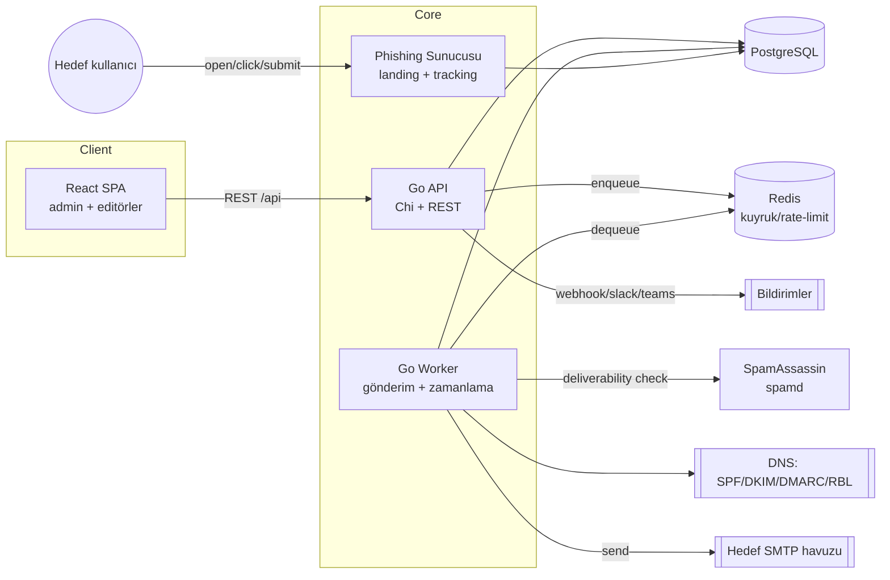

# PhishForge — Mimari

## 1. Teknoloji yığını ve gerekçe

| Katman | Seçim | Gerekçe |
|--------|-------|---------|
| Backend | **Go 1.26 + Chi router** | GoPhish ekosistemiyle uyum (`text/template` merge-tag), düşük bellek, kolay tek-binary, güçlü concurrency (gönderim worker'ları). Fiber yerine Chi: stdlib `net/http` uyumlu, sade, test edilebilir. |
| Worker | **Go (aynı binary, `--mode=worker`)** | Kod paylaşımı; API ve worker aynı imaj, farklı entrypoint. Redis kuyruğundan iş çeker. |
| Frontend | **React + TypeScript + Vite + Tailwind** | Drag-and-drop editör, canlı önizleme, modern UX. Vite hızlı build; Tailwind tutarlı tasarım. |
| Veritabanı | **PostgreSQL 16** | İlişkisel bütünlük, tenant izolasyonu, JSONB (esnek şablon/olay), güçlü raporlama sorguları. |
| Kuyruk/Cache | **Redis 7** | Gönderim kuyruğu, rate-limit sayaçları, zamanlanmış kampanya tetikleyicileri, kısa-ömürlü durum. |
| Migrations | **golang-migrate** | Versiyonlu şema; başlangıçta otomatik uygulanır. |
| E-posta | **Yapılandırılabilir SMTP havuzları** | Angajman başına gönderen profili; warm-up ve rate-limit worker'da. |
| Deliverability | miekg/dns (SPF/DKIM/DMARC lookup), SpamAssassin (spamd), harici RBL DNS | Gönderim öncesi teslimat sağlığı skoru. |

> Not: Backend için Go seçildi. Alternatif FastAPI da uygundu; Go, GoPhish şablon uyumu + tek-imaj
> API/worker sadeliği + gönderim concurrency'si nedeniyle tercih edildi.

## 2. Bileşen diyagramı



## 3. Süreç modelleri (aynı imaj, farklı entrypoint)

- `phishforge serve --mode=api` — REST API + statik SPA servis + phishing sunucusu (küçük kurulumda birleşik).
- `phishforge serve --mode=worker` — Redis kuyruğundan gönderim/zamanlama işlerini işler.
- `phishforge migrate` — şema migration'larını uygular (compose'da başlangıç job'ı).

Büyük kurulumda phishing sunucusu ayrı port/host'ta ayrıştırılabilir (ayrı domain, TLS).

## 4. Veri modeli (özet — PostgreSQL)

```
organizations (id, name, created_at)                         -- tenant kökü
users (id, org_id, email, password_hash, role)               -- role: admin|operator|viewer
engagements (id, org_id, client_name, authz_ref,             -- YETKİ KAYDI
             starts_at, ends_at, status)
scope_rules (id, engagement_id, kind, pattern)               -- allowlist: domain / email glob
sending_profiles (id, org_id, name, smtp_host, smtp_port,
                  username, secret_ref, from_addr, dkim_ref)
targets (id, engagement_id, email, first_name, last_name,
         position, timezone, attrs jsonb)
target_groups (id, engagement_id, name)
target_group_members (group_id, target_id)
email_templates (id, org_id, name, subject, html, text,
                 version, attachments jsonb)
landing_pages (id, org_id, name, html, capture_config jsonb, -- ham parola saklanmaz
               redirect_url)
campaigns (id, engagement_id, name, email_template_id,
           landing_page_id, sending_profile_id, schedule jsonb,
           throttle jsonb, ab_config jsonb, status)
campaign_targets (id, campaign_id, target_id, rid_hmac,      -- imzalı benzersiz token
                  status)
events (id, campaign_target_id, type, ts, ip, ua, meta jsonb)-- type: sent|open|click|submit|report
training_assignments (id, target_id, module_id, status)
deliverability_reports (id, campaign_id, spf, dkim, dmarc,
                        spam_score, rbl jsonb, seed jsonb, created_at)
audit_log (id, org_id, actor_id, action, entity, entity_id,  -- append-only
           ts, meta jsonb)
webhooks (id, org_id, url, secret_ref, events text[])
```

Guardrail: `campaign` gönderimi sırasında her `target.email`, angajmanın `scope_rules`'ına karşı
doğrulanır; eşleşmeyen adres reddedilir ve `audit_log`'a yazılır.

## 5. Ana API yüzeyi (özet)

```
POST /api/auth/login                 JWT (kısa ömür) + refresh
GET  /api/engagements                (tenant-scoped, RBAC)
POST /api/engagements                authz_ref + tarih + scope zorunlu
POST /api/engagements/{id}/scope
CRUD /api/targets, /api/target-groups
CRUD /api/email-templates            versiyonlu
CRUD /api/landing-pages
POST /api/landing-pages/import       URL'den yakala/klonla
CRUD /api/sending-profiles           secret'lar ayrı store
POST /api/deliverability/check       SPF/DKIM/DMARC/spam/RBL/lint
POST /api/deliverability/seed-test   inbox placement
CRUD /api/campaigns
POST /api/campaigns/{id}/launch      -> scope doğrulama -> Redis enqueue
GET  /api/campaigns/{id}/report      funnel + timeline
GET  /api/campaigns/{id}/export      csv|pdf
POST /api/webhooks
GET  /api/audit-log                  append-only, filtreli

# Phishing sunucusu (ayrı router, farklı host önerilir)
GET  /t/{rid}                        tracking pixel (open)
GET  /l/{rid}                        landing (click)
POST /l/{rid}                        submit olayı (ham parola YOK)
GET  /r/{rid}                        "phishing bildir" (report)
```

## 6. Dağıtım topolojisi

`docker-compose.yml` servisleri:

- `postgres` (volume `pgdata`, healthcheck)
- `redis` (healthcheck)
- `migrate` (tek seferlik, `depends_on: postgres healthy`)
- `api` (`depends_on: migrate` tamamlanınca; portlar: admin 8080, phishing 8081)
- `worker` (`depends_on: redis, postgres`)
- `spamassassin` (spamd; deliverability skoru için, opsiyonel profil)

Tüm yapılandırma `.env` (bkz. `.env.example`). Migration'lar başlangıçta otomatik. TLS/rezerse-proxy
için README'de Caddy/Traefik örneği. İlk admin CLI (`phishforge admin create`) veya ilk-kurulum sihirbazı ile.

## 7. Güvenlik kararları

- Şifreler `argon2id`; JWT kısa ömür + refresh rotasyonu.
- SMTP/DKIM secret'ları DB'de değil, referansla (`secret_ref`) — env/secret store.
- `rid` = HMAC(server_key, campaign_target_id) → tahmin/enumerasyon zorluğu.
- Landing capture: parola alanları **hash bile edilmeden atılır**; yalnızca "submitted" + alan adları meta'sı.
- Append-only `audit_log`; kritik mutasyonlar (launch, scope değişimi) loglanır.
- Rate-limit ve CSRF/CORS sıkılaştırması; admin ve phishing yüzeyleri ayrı origin.

## 8. Yol haritası (uygulama sırası)

1. İskelet: repo düzeni, Go modülü, Postgres+Redis compose, migrate, sağlık ucu, JWT auth, RBAC, tenant.
2. Çekirdek CRUD: engagements + scope, targets/groups, templates, landing, sending-profiles.
3. Kampanya + worker: enqueue, scope doğrulama, gönderim, tracking sunucusu, events.
4. Deliverability modülü: SPF/DKIM/DMARC, spam skoru, RBL, seed-test, warm-up.
5. Analitik/raporlama + PDF/CSV; bildirimler (webhook/Slack/Teams).
6. Frontend editörler (drag-and-drop e-posta + landing), dashboard, funnel görselleştirme.
7. CI (GitHub Actions), testler, README, sertleştirme.
```

